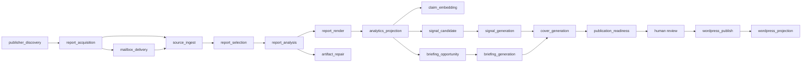
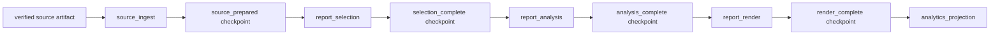
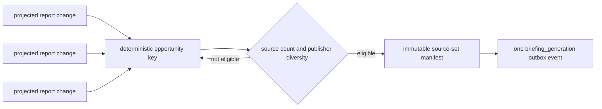
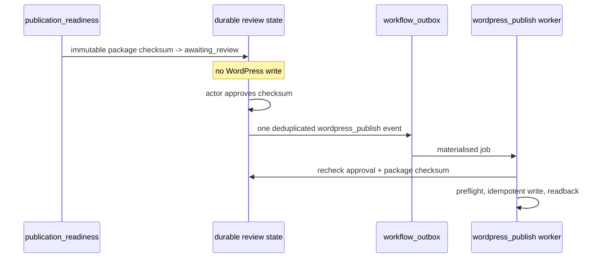
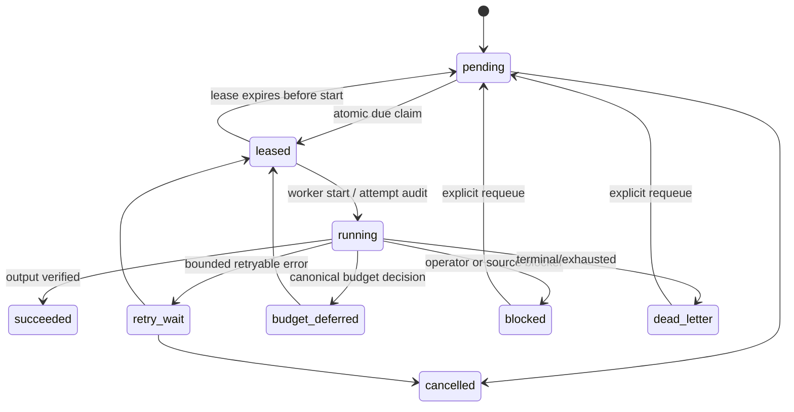
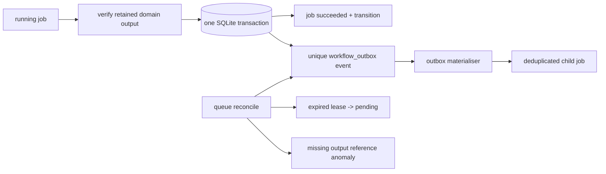

# Asynchronous Workflow Queue

> **Documentation type:** Current reference
> **Canonical topic:** Durable asynchronous workflow execution
> **Update trigger:** Queue schema, worker lifecycle, handler registry, approval, or recovery changes.

MarketLense uses one SQLite-backed durable queue platform with explicit typed
logical queues. It is an at-least-once delivery system: an expired lease can
deliver a job again, while deterministic idempotency keys, domain hashes,
readback verification, lineage checks, and unique outbox event identities are
used to make effective outcomes exactly once. It is not a generic DAG engine
and it does not claim exactly-once delivery.

Queue rows retain only scalar context and immutable references. PDFs, source
text, prompts, HTML, vectors, mailbox state, acquisition state, costs, and
publication records remain in their existing canonical stores.

## Fixed graph



The registry declares the critical queues above plus `artifact_repair`,
`source_revalidation`, `malformed_pdf_revalidation`, `recategorization`,
`vector_retention`, `wordpress_category_update`, `public_render_repair`,
`cost_reconciliation`, and `release_evidence_generation`. It rejects an
unregistered queue/job combination and rejects an unapproved downstream type.

## Report checkpoint handoffs



The report-stage handlers invoke the existing report-generation entrypoint,
which has explicit `stop_after_stage` boundaries at
these checkpoints. A selection, analysis, or render worker resumes from the
prior validated checkpoint rather than re-running PDF extraction or earlier
model work. Analytics projection has a projection-only path from validated
analysis and render checkpoints.

The foundation retains a verified-reference compatibility handler for domain
adapters that have not yet been migrated. It deliberately cannot manufacture
domain outputs or perform external writes; each remaining adapter must replace
that bridge before the corresponding queue is enabled for operational work.

`publisher_discovery`, `report_acquisition`, and `mailbox_delivery` invoke
their existing production orchestrators. They enqueue `source_ingest` only
after `file_service` verifies a retained local artifact and its content hash.
Email-gated sources enqueue mailbox delivery instead of calling it in memory.
`publication_readiness` records immutable readiness; the explicit
`queue-approve-publication --yes` command creates only a WordPress outbox
event, never a WordPress write. `--dry-run` carries a no-write instruction to
that durable job so the real publish preflight can be validated without
enabling live publication.

## Briefing fan-in



Opportunity membership uses sorted source hashes and distinct publisher IDs.
Frozen or generated opportunities are immutable; later source changes collect
in a later opportunity. No cross-publisher metric normalization is performed.
The `briefing_opportunity` worker now owns this aggregation and writes the
single frozen-generation outbox event; it performs no model generation itself.
The generation configuration hash includes all bounded selection and prompt
settings, so a deliberate compatibility change can be replayed without
mistaking a prior terminal configuration for the same effective request.

## Approval and WordPress publication



Approval is bound to a package checksum. A changed package is a different
readiness record and has no inherited approval. Rejection does not enqueue
publication. Live WordPress execution remains feature-gated by existing
publication policy.

## Lease and retry lifecycle



A heartbeat extends only the owning unexpired lease. Completion and failure SQL
updates require the worker ID and unexpired lease, so a stale worker cannot
commit an external outcome after recovery has released its job.

## Outbox and reconciliation



If a process stops after the output write but before queue completion, domain
idempotency/readback allows replay. If it stops after completion but before
outbox materialisation, the retained outbox event creates the child later.
Reconciliation automatically repairs only deterministic store anomalies and
reports uncertain external effects for remediation.

## Operations

The CLI seeds configuration defaults from `workflow_queues` into durable
controls without overwriting an existing operator setting:

```text
python -m src.cli queue-list
python -m src.cli queue-health --queue report_analysis
python -m src.cli queue-pause report_acquisition --reason "provider incident"
python -m src.cli queue-resume report_acquisition
python -m src.cli queue-drain report_analysis --reason "planned maintenance"
python -m src.cli queue-inspect-job <job-id>
python -m src.cli queue-release-expired-leases
python -m src.cli queue-materialize-outbox
python -m src.cli queue-reconcile
python -m src.cli queue-migrate-deferred-work --yes
python -m src.cli queue-approve-publication --package-checksum <sha> --package-reference <path> --entity-type briefing --dry-run --yes
python -m src.cli workflow-worker --queue publisher_discovery --limit 1
```

`queue-cancel` and `queue-requeue` require `--yes`. A worker invocation is
bounded; an external supervisor decides recurrence. Queue health exposes status
counts, ages, expired leases, runtime estimates, attempts, and pending outbox
work without retaining prompts, source text, credentials, or raw provider data.

SQLite remains appropriate for the current one-host, conservative-worker
deployment. Reassess PostgreSQL or a broker only after measured sustained lock
contention, queue-health query latency, or required independent multi-host
concurrency exceeds the bounded SQLite worker limits.

## Legacy budget-deferred compatibility

New queue-worker budget decisions use the canonical `budget_deferred` state;
there is no second due-work scheduler for new work. The retained usage-ledger
rows remain readable while `queue-migrate-deferred-work --yes` hands off the
currently supported `report_generation` records. The adapter verifies the
retained local PDF and creates a single `source_ingest` job with deterministic
legacy-work lineage, original due time, remaining attempt budget and plan hash.
It does not delete or mutate the historical row. Unsupported workflows, missing
artifacts and exhausted legacy retries are reported as unresolved for operator
action rather than being silently retried by a parallel scheduler.

## Domain queue adapters

`claim_embedding` delegates to the canonical claim/embedding store and its
existing oldest-first fairness, execution-lease, unchanged-content, retry and
cost-accounting rules. The workflow job only carries the claim/embedding row
reference; it never copies claim text or vector data into `workflow_jobs`.
`signal_candidate` delegates to the existing source-linked deterministic
candidate extractor, retains candidates in the analytics store, and emits one
deduplicated `signal_generation` job per approved candidate group. Both workers
reject malformed bounded attributes before opening a projection or provider
operation.

`wordpress_publish` accepts only an approved immutable Briefing or Signal artifact. The
approval transaction injects its durable approval ID into the outbox submission;
the worker verifies that ID and the artifact checksum before loading the package
or contacting WordPress. It then delegates taxonomy, media, idempotency, and
readback to the established publisher. Live writes remain feature-gated; a
verified WordPress post emits one deduplicated `wordpress_projection` job.
`wordpress_projection` validates that verified post reference, then delegates
the public-entity read, deterministic intelligence build, and WordPress
readback-backed projection write to the existing projection orchestrator. It is
gated by the same live-publication authority, so a disabled site leaves the job
blocked for explicit operator action rather than creating a second write path.

## Configuration resolution

Queue payloads may carry the bounded `config_path` attribute already supported
by the report-stage adapters. Every migrated handler resolves that path through
the canonical configuration service before it opens its domain service. This
keeps compatibility and isolated live-validation profiles on the same typed
worker path while production jobs continue to use the canonical application
configuration when the attribute is absent. The attribute is a local operator
profile reference only: it never contains configuration content or secrets and
is validated before any provider or publishing operation.

## UI compatibility migration

Publisher Discovery, Report Download, Signal Candidate Extraction, Signal Post,
and Cross-Report Analysis launched from Streamlit submit the same typed durable
queue jobs as the CLI. Cross-report UI input enters `briefing_opportunity` and
uses canonical projected evidence to form a frozen manifest; Signal Post enters
`signal_candidate` and has the registered worker create independent generation
jobs. The UI run registry retains a user-facing run identifier and the durable
job ID, polls queue state, and forwards a safe cancel request; it does not start
or own a hidden workflow subprocess for these migrated flows. Existing UI-run
payloads that do not request queue submission continue through the bounded
compatibility worker while lower-risk legacy screens are migrated.
