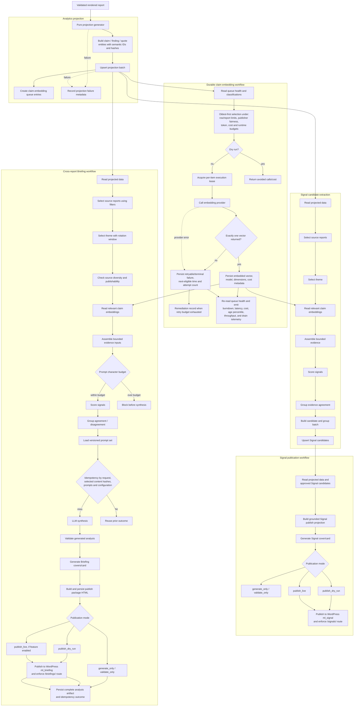
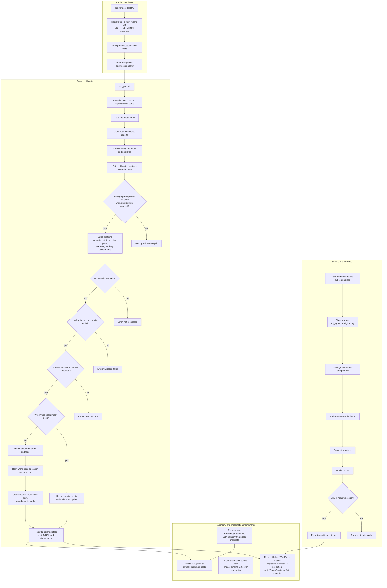

# MarketLense Workflow Architecture Map

**Repository:** `mbrakker/marketlense`  
**Branch inspected:** `main`  
**Scope:** Workflow-level analysis of all public orchestrators registered in the generated capability manifest, all registered CLI commands, their principal generators/services, retained artifacts, external systems, checkpoints, queues, state transitions, retries, and terminal-failure handling.

## Coverage definition

This map covers:

- **34/34 public orchestrator modules**
- **29/29 registered CLI commands**
- Primary report lifecycle: discovery → acquisition → ingest → analysis → validation → rendering → publication
- Derived intelligence: analytics projections, embeddings, Signal candidates, Signals, cross-report Briefings
- Control plane: preflight, budgets, retries, remediation, UI workers, replay, operational memory, cost and health reporting
- Persistence boundaries: filesystem, SQLite stores, Google Drive, vector stores, WordPress, mailbox and browser runtime

It does **not** expand every private helper function, test fixture, WordPress PHP/theme implementation, browser-use internals, or third-party SDK internals. At the repository workflow level, coverage is effectively 100%.

---

# 1. Whole-system workflow landscape

```mermaid
flowchart LR
    subgraph ENTRY["Entry surfaces"]
        CLI["Typer CLI<br/>29 commands"]
        UI["Streamlit / UI run control"]
        SCHED["External scheduler / operator"]
    end

    subgraph SOURCE["Source systems"]
        PUBCFG["Publisher profile snapshot"]
        INSIGHTS["Publisher insight / research pages"]
        URL["Known report URL"]
        GDRIVEIN["Google Drive PDF folders"]
        LOCALPDF["Local PDF"]
        MAIL["Mailbox"]
    end

    subgraph CONTROL["Shared control plane"]
        WFCTRL["Workflow control<br/>intent, contracts, concurrency,<br/>health and publish policy"]
        PREFLIGHT["Pipeline preflight<br/>paths, prompts, LLM, Drive,<br/>browser, WordPress"]
        BUDGET["Canonical run budgets<br/>tokens, calls, browser, PDFs,<br/>Drive, mailbox, WordPress"]
        RETRY["Retry decision engine<br/>retry / defer / abort / user action"]
        REM["Remediation ledger + bounded reaper"]
        IDEM["Idempotency + artifact lineage<br/>minimal execution planning"]
    end

    subgraph DISCOVERY["Discovery and acquisition"]
        PSYNC["Publisher sync"]
        PINV["Publisher inventory discovery"]
        AUDIT["Acquisition audit"]
        RDL["Report download route planner"]
        MACQ["Mailbox acquisition"]
    end

    subgraph REPORT["Report production"]
        INGEST["Batch ingest"]
        IFILE["Per-file ingest"]
        RPIPE["Report pipeline"]
        RGEN["Report generation<br/>checkpointed stages"]
        RAN["Report analysis"]
        VALID["Validation + targeted regeneration"]
        RENDER["HTML and report-card rendering"]
    end

    subgraph INTEL["Derived intelligence"]
        APROJ["Analytics projection"]
        EMB["Claim embedding queue"]
        SCAND["Signal candidate extraction"]
        SPOST["Signal post workflow"]
        CROSS["Cross-report Briefing workflow"]
        COVERS["Cover generation"]
    end

    subgraph PUBLISH["Publication and projections"]
        PQUEUE["Publish readiness snapshot"]
        WPUB["WordPress publication"]
        WPCAT["WordPress category update"]
        WPINT["WordPress intelligence projection"]
        RECAT["Recategorization"]
    end

    subgraph STORES["Retained state and artifacts"]
        RDB[("reports.sqlite<br/>metadata, publishers, routes,<br/>projections, lineage")]
        SDB[("state.sqlite<br/>processed, published, cursors,<br/>mail delivery, remediation")]
        FS[("Filesystem<br/>cache, checkpoints, evidence,<br/>artifacts, HTML, covers")]
        GDRIVE[("Google Drive<br/>source PDFs, captures,<br/>inventory snapshots")]
        VSTORE[("Vector stores")]
        ADB[("Analytics projection /<br/>embedding / Signal store")]
        WP[("WordPress<br/>Reports, Signals, Briefings,<br/>Topics, Publishers")]
    end

    CLI --> WFCTRL
    UI --> WFCTRL
    SCHED --> WFCTRL
    WFCTRL --> PREFLIGHT
    PREFLIGHT --> BUDGET
    BUDGET --> RETRY
    RETRY --> IDEM

    PUBCFG --> PSYNC
    INSIGHTS --> PINV
    URL --> RDL
    MAIL --> MACQ
    GDRIVEIN --> INGEST
    LOCALPDF --> IFILE

    PSYNC --> RDB
    PINV --> RDL
    PINV --> RDB
    PINV --> GDRIVE
    AUDIT --> PINV
    AUDIT --> RDL
    RDL --> GDRIVE
    RDL --> SDB
    RDL -. deferred email .-> MACQ
    MACQ --> RDL

    GDRIVE --> INGEST
    INGEST --> IFILE
    IFILE --> RPIPE
    RPIPE --> RGEN
    RGEN --> RAN
    RAN --> VALID
    VALID --> RENDER

    RENDER --> APROJ
    RENDER --> COVERS
    APROJ --> ADB
    APROJ --> EMB
    APROJ --> SCAND
    ADB --> CROSS
    ADB --> SPOST
    EMB --> CROSS
    EMB --> SCAND
    SCAND --> SPOST

    RENDER --> PQUEUE
    PQUEUE --> WPUB
    CROSS --> WPUB
    SPOST --> WPUB
    WPUB --> WP
    WPUB --> SDB
    WPCAT --> WP
    WPINT --> WP
    RECAT --> RDB

    RGEN --> FS
    RAN --> FS
    RAN --> RDB
    RAN --> VSTORE
    APROJ --> RDB
    IDEM --> RDB
    IDEM --> SDB

    RETRY -. terminal failure .-> REM
    REM --> SDB
    REM -. approved repair .-> RDL
    REM -. checkpoint resume .-> RGEN
    REM -. idempotent retry .-> WPUB
```

---

# 2. Publisher discovery and report acquisition

```mermaid
flowchart TD
    START["Publisher / URL acquisition request"]

    subgraph PUBLISHERS["Publisher registry"]
        SNAP["Publisher profile snapshot"]
        LOADPUB["Load and validate profiles"]
        REPLACE["Replace publisher registry"]
        PDB[("Publisher records in reports DB")]
        SNAP --> LOADPUB --> REPLACE --> PDB
    end

    subgraph INVENTORY["Publisher inventory discovery"]
        ISTART["Insights URL"]
        STATE["Read remembered inventory route,<br/>quality and Drive folder"]
        ENSURE["Ensure publisher Drive folder"]
        PREVSNAP["Load previous inventory snapshot"]
        IPLAN{"Plan route"}
        MEMI["Reuse remembered route"]
        HTTPI["HTTP parse"]
        BROWSERI["Browser render / pagination"]
        BUILD["Build canonical snapshot and delta"]
        SCREEN["LLM screen likely report assets"]
        QUALIFY["Resource-quality qualification<br/>and ranking"]
        RECOVERY["Persist deferred recovery cache<br/>for temporarily unreachable candidates"]
        COVERAGE{"Coverage validation"}
        BADDELTA["Reject undercoverage,<br/>raw-only delta or systematic failure"]
        ALLOW["Allow snapshot"]
        RUNQ["Evaluate run quality and<br/>recommended future route"]
        UPLOAD["Upload changed snapshot to Drive"]
        SOURCES["Upsert qualified report sources"]
        ISTATE["Persist route/scenario/state/test status"]

        ISTART --> STATE --> ENSURE --> PREVSNAP --> IPLAN
        IPLAN --> MEMI
        IPLAN --> HTTPI
        IPLAN --> BROWSERI
        MEMI --> BUILD
        HTTPI --> BUILD
        HTTPI -. empty / retryable .-> BROWSERI
        BROWSERI --> BUILD
        BUILD --> SCREEN --> QUALIFY --> RECOVERY --> COVERAGE
        COVERAGE --> BADDELTA
        COVERAGE --> ALLOW
        ALLOW --> RUNQ --> UPLOAD --> SOURCES --> ISTATE
    end

    subgraph DOWNLOAD["Per-report acquisition"]
        DSTART["Qualified candidate or direct URL"]
        DPRE["Preflight required Drive archive<br/>and mailbox configuration"]
        MEMORY["Read exact-URL and publisher<br/>download-route memory"]
        DPLAN{"Route plan, ordered by evidence"}

        DMEM["Remembered successful route"]
        CPDF["Candidate / redirect PDF probe"]
        DPDF["Direct PDF probe"]
        HTTPP["HTTP PDF probe"]
        BGEN["Generic browser download"]
        BFORM["Browser email-form route"]
        BONSITE["Browser on-site longread capture"]
        BHTTP["Browser-to-HTTP recovery"]

        ATTEMPT["Execute route under runtime,<br/>PDF and browser budgets"]
        FORENSICS["Persist terminal HTML/screenshot/<br/>route evidence on failed attempt"]
        FALLBACK{"Fallback route available<br/>and failure eligible?"}

        OUTCOME{"Acquisition outcome"}
        DOWN["Downloaded PDF"]
        CAP["Captured on-site report"]
        EMAILREQ["Email requested / required"]
        BLOCK["Blocked: CAPTCHA, credentials,<br/>paywall, weak evidence or terminal route"]
        ROUTEMEM["Record route outcome, learned selectors,<br/>identity fields and private-API evidence"]
        ARCHIVE["Archive successful source/capture to Drive"]
        DEFER["Persist deferred mail-delivery request"]

        DSTART --> DPRE --> MEMORY --> DPLAN
        DPLAN --> DMEM
        DPLAN --> CPDF
        DPLAN --> DPDF
        DPLAN --> HTTPP
        DPLAN --> BGEN
        DPLAN --> BFORM
        DPLAN --> BONSITE
        DPLAN --> BHTTP

        DMEM --> ATTEMPT
        CPDF --> ATTEMPT
        DPDF --> ATTEMPT
        HTTPP --> ATTEMPT
        BGEN --> ATTEMPT
        BFORM --> ATTEMPT
        BONSITE --> ATTEMPT
        BHTTP --> ATTEMPT

        ATTEMPT --> OUTCOME
        ATTEMPT -. failure .-> FORENSICS --> FALLBACK
        FALLBACK -- yes --> DPLAN
        FALLBACK -- no --> BLOCK

        OUTCOME --> DOWN
        OUTCOME --> CAP
        OUTCOME --> EMAILREQ
        OUTCOME --> BLOCK
        DOWN --> ROUTEMEM --> ARCHIVE
        CAP --> ROUTEMEM --> ARCHIVE
        EMAILREQ --> ROUTEMEM --> DEFER
        BLOCK --> ROUTEMEM
    end

    subgraph MAILBOX["Deferred mailbox delivery"]
        DUE["Due mail-delivery request"]
        QUERY["Build publisher/title query terms"]
        POLL["Poll mailbox under read/runtime budget"]
        FILTER["Filter by request watermark,<br/>seen IDs and rejection memory"]
        ATTACH{"Matching PDF attachment?"}
        LINKS["Rank report links in messages"]
        DLINK["Re-enter report download workflow"]
        REJECT["Persist non-retryable link rejection"]
        TIMEOUT{"Poll deadline reached?"}
        WAIT["Sleep to next poll"]
        MCOMP["Promote mailbox route memory<br/>and mark delivery complete"]

        DUE --> QUERY --> POLL --> FILTER --> ATTACH
        ATTACH -- yes --> MCOMP
        ATTACH -- no --> LINKS --> DLINK
        DLINK -- downloaded/captured --> MCOMP
        DLINK -- non-retryable failure --> REJECT --> TIMEOUT
        DLINK -- retryable failure --> TIMEOUT
        TIMEOUT -- no --> WAIT --> POLL
        TIMEOUT -- yes --> MFAIL["Deferred / remediation record"]
    end

    subgraph AUDITFLOW["Acquisition audit"]
        ALIST["List publishers"]
        AINV["Run inventory discovery per publisher"]
        ACANDS["Select bounded candidate set"]
        ADOWN["Run download with Drive writes disabled"]
        ASUM["Summarize route/outcome/error mix<br/>and recommend publisher flow"]
        AJSON["Persist acquisition_audit.json"]
        ALIST --> AINV --> ACANDS --> ADOWN --> ASUM --> AJSON
    end

    START --> ISTART
    PDB --> STATE
    SOURCES --> DSTART
    ARCHIVE --> INGESTBOUNDARY["Drive/source-store handoff to ingest"]
    DEFER --> DUE
```

### Acquisition result boundaries

- **Downloaded PDF** and **captured on-site report** are archived and become ingestible source artifacts.
- **Email requested/required** becomes a durable deferred-delivery item; mailbox polling is a separate workflow.
- **Blocked/permanent failures** retain route evidence and remediation context rather than being silently discarded.
- Route memory exists at both exact-URL and publisher scope and influences future route ordering.

---

# 3. Report ingest, analysis, validation and rendering

```mermaid
flowchart TD
    subgraph BATCH["Batch ingest coordinator"]
        I0["ingest command / UI run"]
        LOCK{"Acquire ingest lock"}
        DBPRE["Preflight state and reports DB"]
        LIST["List Drive PDFs<br/>cursor or full scan"]
        MAT["Materialize bounded batch"]
        PREFETCH["Parallel cache prefetch"]
        CACHE{"Valid cached MD5 + EOF?"}
        DOWNLOAD["Download PDF from Drive"]
        EOF["Validate EOF / retry corrupt download"]
        SKIP{"Already processed with same MD5<br/>and complete retained state?"}
        WORKERS["Parallel per-file workers"]
        CURSOR{"Batch complete without errors,<br/>without explicit limit?"}
        ADVANCE["Advance ingest cursor"]
        RETAIN["Run vector-store retention cleanup"]
        USAGE["Finalize usage projection"]
        UNLOCK["Release ingest lock"]

        I0 --> LOCK
        LOCK -- unavailable --> ILOCKFAIL["Exit: concurrent ingest"]
        LOCK -- acquired --> DBPRE --> LIST --> MAT --> PREFETCH --> CACHE
        CACHE -- yes --> SKIP
        CACHE -- no --> DOWNLOAD --> EOF --> SKIP
        SKIP -- yes --> ISKIP["Skipped / report-card backfill check"]
        SKIP -- no --> WORKERS
        ISKIP --> CURSOR
        WORKERS --> CURSOR
        CURSOR -- yes --> ADVANCE --> RETAIN --> USAGE --> UNLOCK
        CURSOR -- no --> RETAIN --> USAGE --> UNLOCK
    end

    subgraph PERFILE["Per-file ingest"]
        F0["Drive file or local PDF"]
        HTMLSKIP{"Matching rendered HTML already exists?"}
        CACHE2["Resolve sidecar and cached MD5"]
        REDOWN["Download / refresh invalid cache"]
        BADPDF{"Permanent invalid PDF?"}
        META["Ensure report metadata row"]
        STATECHECK{"Processed state reusable?"}
        PLAN["Build minimal execution plan<br/>from source hashes, lineage,<br/>compatibility and requested outputs"]
        RESUME{"Resolve resume stage"}
        PIPE["Run report pipeline"]
        FSTATE["Record processed/error state,<br/>text/OCR/doc-map/vector metadata"]

        F0 --> HTMLSKIP
        HTMLSKIP -- yes --> FSKIP["Skip"]
        HTMLSKIP -- no --> CACHE2
        CACHE2 --> REDOWN --> BADPDF
        BADPDF -- yes --> FBAD["Record permanent bad-PDF state"]
        BADPDF -- no --> META --> STATECHECK
        STATECHECK -- reusable --> FSKIP
        STATECHECK -- process --> PLAN --> RESUME --> PIPE --> FSTATE
    end

    subgraph PIPELINE["Report pipeline and budget envelope"]
        P0["Workflow preflight"]
        PALLOW{"Expensive effects allowed?"}
        RATE["Rate limits + retry policy"]
        PBUDGET["Create run budget"]
        RESERVE["Reserve PDF/model side effects"]
        ATTEMPTS["Run report-generation attempt"]
        CKMISS{"latest_safe checkpoint missing?"}
        FRESH["Fallback to fresh run"]
        FINALIZE["Finalize reserved actual usage"]
        PERR["Record pipeline error outcome<br/>and remediation evidence"]

        P0 --> PALLOW
        PALLOW -- no --> PBLOCK["Block before model/PDF effects"]
        PALLOW -- yes --> RATE --> PBUDGET --> RESERVE --> ATTEMPTS
        ATTEMPTS -. checkpoint missing .-> CKMISS
        CKMISS -- yes --> FRESH --> ATTEMPTS
        ATTEMPTS --> FINALIZE
        ATTEMPTS -. terminal failure .-> PERR
    end

    subgraph GENERATION["Checkpointed report generation"]
        G0["Build runtime, source identity,<br/>artifact paths and scoped LLM clients"]

        S1["Stage 1: source_prepared"]
        PARSE["Parse PDF text and page structure"]
        TEXTQ{"Text extractable and valid?"}
        OCR["OCR fallback and re-parse"]
        SPERSIST["Persist source artifacts,<br/>source hashes and checkpoint"]

        S2["Stage 2: selection_complete"]
        VINDEX["Create/index vector store asynchronously"]
        CAND["Detect chart/table/figure candidates"]
        CROP["Render crops"]
        CROPQA["Crop QA, refinement and selection"]
        SELPERSIST["Persist selection artifact,<br/>vector state and checkpoint"]

        S3["Stage 3: analysis_complete"]
        VWAIT["Await vector indexing"]
        PARALLEL["Parallel taxonomy + evidence packs"]
        EVID["Evidence packs and citations"]
        TAX["Taxonomy"]
        CONTEXT["Build report context and<br/>context-first category fit"]
        VMETA["Update vector metadata"]
        DOCMAP["Generate document map;<br/>resolve title and publisher"]
        NORM["Normalize evidence payloads"]
        ART["Generate artifact families,<br/>optionally batched"]
        CAPTION["Generate figure captions"]
        COMPLETE["Completeness checks"]
        VALIDATE["Schema, semantic and grounding validation"]
        REGEN{"Validation passes?"}
        TARGET["Targeted bounded regeneration<br/>of invalid artifact families"]
        APERSIST["Persist analysis snapshot,<br/>artifacts, validation, evidence,<br/>registry and lineage checkpoint"]

        S4["Stage 4: render_complete"]
        VALUE["Compute source-value score"]
        HTML["Render report HTML and report-card assets"]
        DATEQ{"Publication date usable?"}
        DATEFAIL["Stop at analysis_complete;<br/>checkpoint-safe date remediation"]
        RCP["Persist render checkpoint"]

        POST["Post-render enrichment"]
        PROJ["Project claims/findings/quotes<br/>to analytics store"]
        SIGNAL["Extract/store Signal candidates"]
        RCP2["Rewrite render checkpoint with<br/>projection and Signal outcomes"]
        CLEAN["Delete transient vector store<br/>when retention policy requires"]

        G0 --> S1 --> PARSE --> TEXTQ
        TEXTQ -- no --> OCR --> PARSE
        TEXTQ -- yes --> SPERSIST
        SPERSIST --> S2 --> VINDEX --> CAND --> CROP --> CROPQA --> SELPERSIST
        SELPERSIST --> S3 --> VWAIT --> PARALLEL
        PARALLEL --> EVID
        PARALLEL --> TAX
        EVID --> CONTEXT
        TAX --> CONTEXT
        CONTEXT --> VMETA --> DOCMAP --> NORM --> ART --> CAPTION --> COMPLETE --> VALIDATE --> REGEN
        REGEN -- no --> TARGET --> VALIDATE
        REGEN -- yes --> APERSIST
        APERSIST --> S4 --> VALUE --> HTML --> DATEQ
        DATEQ -- no --> DATEFAIL
        DATEQ -- yes --> RCP --> POST --> PROJ --> SIGNAL --> RCP2 --> CLEAN
    end

    subgraph RESUMELOOP["Resume and repair loop"]
        CHECKPOINTS[("Retained checkpoints<br/>source_prepared<br/>selection_complete<br/>analysis_complete<br/>render_complete")]
        LATEST["latest_safe resolver"]
        REMEDIATE["Remediation ledger"]
        DATEREPAIR["Publication-date checkpoint repair:<br/>update artifacts only, refresh lineage,<br/>preserve upstream work"]
        TARGETREPAIR["Targeted artifact-family regeneration"]
        CHECKPOINTS --> LATEST
        REMEDIATE --> LATEST
        REMEDIATE --> DATEREPAIR
        REMEDIATE --> TARGETREPAIR
        LATEST --> G0
        DATEREPAIR --> S4
        TARGETREPAIR --> VALIDATE
    end

    WORKERS --> F0
    PIPE --> P0
    ATTEMPTS --> G0
    SPERSIST --> CHECKPOINTS
    SELPERSIST --> CHECKPOINTS
    APERSIST --> CHECKPOINTS
    RCP2 --> CHECKPOINTS
```

### Retained report artifact families

The pipeline retains, at minimum:

- Source PDF / analysis PDF, extracted text and OCR derivative when needed
- Page structure and document map
- Figure candidates, crop selections and crop-QA evidence
- Evidence packs, taxonomy and category-fit context
- Structured report artifacts and figure captions
- Validation report and regeneration history
- Rendered HTML and report-card assets
- Artifact registry, hashes, lineage and stage checkpoints
- Analytics projection rows and embedding-queue references

---

# 4. Analytics projections, embeddings, Signals and Briefings

### Important dependency direction

Cross-report Briefings and Signals consume **projected, hashed, source-linked evidence** and optional claim embeddings. They do not re-open arbitrary raw PDFs as their primary evidence source. This makes existing processed reports reusable without re-ingestion.

---

# 5. Publication, taxonomy and WordPress projections

---

# 6. Workflow control, retries, remediation, UI execution and operations

```mermaid
flowchart TD
    subgraph INTENT["Workflow intent and authorization"]
        REQUEST["Operator / UI / scheduled request"]
        RESOLVE["Resolve explicit intent"]
        CONTRACT["Load workflow DAG/state contract"]
        PROFILE["Resolve preflight profile and prompt namespaces"]
        PREFLIGHT["Run local path, LLM, prompt,<br/>Drive, browser and WordPress checks"]
        AUTOFIX["Apply safe preflight remediations:<br/>create paths / refresh available Drive credentials"]
        QUALITY["Pre-LLM data quality gate"]
        HEALTH["Run health gate"]
        CONCUR["Concurrency decision"]
        POLICY["Publish policy decision"]
        MEMORY["Operational memory recommendation<br/>from publisher/route outcomes"]
        AUTH{"Execution authorized?"}
        PLAN["Emit execution plan:<br/>workflow, side effects, resume stage,<br/>retry and budget policy"]

        REQUEST --> RESOLVE --> CONTRACT --> PROFILE --> PREFLIGHT
        PREFLIGHT --> AUTOFIX --> QUALITY --> HEALTH --> CONCUR --> POLICY --> MEMORY --> AUTH
        AUTH -- yes --> PLAN
        AUTH -- no --> HOLD["Blocked / operator action"]
    end

    subgraph RETRYFLOW["Canonical retry engine"]
        CALL["Workflow step call"]
        ERR{"Exception?"}
        DECIDE{"Resolve decision"}
        CRED["user_action_required<br/>for missing credentials"]
        DEFER["defer with next eligible time"]
        ABORT["abort: non-retryable or exhausted"]
        RETRY["retry after backoff/jitter"]
        RBUDGET{"Retry budget allows another attempt?"}
        SLEEP["Sleep"]
        SUCCESS["Return success"]
        TERMINAL["Terminal failure observer"]

        CALL --> ERR
        ERR -- no --> SUCCESS
        ERR -- yes --> DECIDE
        DECIDE --> CRED
        DECIDE --> DEFER
        DECIDE --> ABORT
        DECIDE --> RETRY --> RBUDGET
        RBUDGET -- yes --> SLEEP --> CALL
        RBUDGET -- no --> DEFER
        CRED --> TERMINAL
        DEFER --> TERMINAL
        ABORT --> TERMINAL
    end

    subgraph REMFLOW["Remediation ledger and bounded reaper"]
        RREC["Deduplicated remediation record:<br/>workflow, stage, error, checkpoint,<br/>artifacts, side effects, idempotency, budget"]
        ACTION["Classify action:<br/>checkpoint resume, transient retry,<br/>targeted artifact rerun, source revalidation,<br/>mailbox poll, idempotent publish retry,<br/>credentials or terminal blocker"]
        REAPER["Release expired leases and claim next item"]
        RBUD["Budget check"]
        ALLOW{"Exact workflow/error/action allowlisted?"}
        CK{"Checkpoint valid when required?"}
        IDEM{"Idempotency proof safe?"}
        EXEC{"Executor enabled?"}
        RUN["Transition to retrying and execute"]
        RRESULT{"Outcome"}
        RESOLVED["resolved"]
        RDEFER["deferred"]
        OP["operator_action_required"]
        TERM["terminal"]

        RREC --> ACTION --> REAPER --> RBUD
        RBUD -- blocked --> RDEFER
        RBUD -- allowed --> ALLOW
        ALLOW -- no --> OP
        ALLOW -- yes --> CK
        CK -- no --> OP
        CK -- yes --> IDEM
        IDEM -- already completed --> RESOLVED
        IDEM -- missing / unsafe --> OP
        IDEM -- safe / not required --> EXEC
        EXEC -- no --> OP
        EXEC -- yes --> RUN --> RRESULT
        RRESULT --> RESOLVED
        RRESULT --> RDEFER
        RRESULT --> OP
        RRESULT --> TERM
    end

    subgraph UICTRL["UI run control and replay"]
        ULAUNCH["Create run ID and worker request"]
        UREC["Persist queued run record"]
        PROC["Launch hidden ui-run-worker process"]
        DISPATCH{"Validate payload and dispatch run type"}
        RUNS["Ingest | candidate extraction | covers | publish |<br/>publisher discovery | report download | acquisition audit |<br/>cross-report | Signal extraction | Signal post | replay"]
        UFINAL["Persist status, summary,<br/>artifacts and output log"]
        POLL["Poll process and tail output"]
        CANCEL["Cancel / terminate"]
        DEAD["Classify and reap dead letters"]
        REPLAY["Load replay manifest"]
        FP["Fingerprint source tree,<br/>prompt tree and configuration"]
        DRIFT{"Fingerprint drift?"}
        BLOCKDRIFT["Block replay and write drift report"]
        RERUN["Re-execute original payload"]
        COMPARE["Compare status, errors, summary<br/>and artifact fingerprints"]

        ULAUNCH --> UREC --> PROC --> DISPATCH --> RUNS --> UFINAL
        UFINAL --> POLL
        POLL --> CANCEL
        UFINAL --> DEAD
        UFINAL --> REPLAY --> FP --> DRIFT
        DRIFT -- yes --> BLOCKDRIFT
        DRIFT -- no --> RERUN --> COMPARE
    end

    subgraph OBS["Operations and maintenance"]
        OPS["Ops dashboard snapshot:<br/>reports, processed, published,<br/>remediations, ingest lock, storage health"]
        COST["Cost report and daily rollup"]
        RTEL["Retry telemetry:<br/>success-after-retry, exhaustion,<br/>delay, wasted/avoided calls"]
        VRET["Vector retention cleanup:<br/>scan expired processed rows,<br/>prune stores, update state"]
        TRACE["Trace run / logs"]
    end

    PLAN --> CALL
    TERMINAL --> RREC
    ULAUNCH --> REQUEST
    RTEL --> MEMORY
    RREC --> OPS
    RETRY --> RTEL
```

### Fail-closed automation boundary

Automatic remediation is intentionally narrow:

- Only exact allowlisted workflow/error/action combinations qualify.
- Budget checks, checkpoint validation and idempotency proof are mandatory where relevant.
- Missing executors or uncertain proof transition the item to operator action rather than improvising a repair.

---

# 7. Public orchestrator coverage ledger

| # | Public orchestrator | Principal responsibility | Graph |
|---:|---|---|---|
| 1 | `acquisition_audit_orchestrator` | Audit publisher discovery and candidate acquisition routes | 2 |
| 2 | `analytics_projection_orchestrator` | Project report analysis into reusable semantic rows | 4 |
| 3 | `candidate_extraction_orchestrator` | Standalone chart/table/figure candidate and crop extraction | 3 |
| 4 | `claim_embedding_orchestrator` | Durable, budgeted claim embedding queue | 4 |
| 5 | `cost_reporting_orchestrator` | Cost report and daily rollup | 6 |
| 6 | `cover_image_orchestrator` | Grounded report cover generation/backfill | 4, 5 |
| 7 | `cross_report_analysis_orchestrator` | Cross-report Briefing selection, synthesis, validation and publication | 4 |
| 8 | `ingest_file_orchestrator` | Cache/state-aware per-file ingest handoff | 3 |
| 9 | `ingest_orchestrator` | Locked, batched and parallel Drive ingest | 3 |
| 10 | `mail_report_acquisition_orchestrator` | Poll mailbox and re-enter normal acquisition | 2 |
| 11 | `ops_dashboard_orchestrator` | Operational state/health snapshot | 6 |
| 12 | `pipeline_preflight_orchestrator` | Validate dependencies before expensive side effects | 3, 6 |
| 13 | `publish_orchestrator` | Reports, Signals and Briefings publication | 5 |
| 14 | `publish_queue_orchestrator` | Read-only publication readiness snapshot | 5 |
| 15 | `publisher_inventory_orchestrator` | Publisher inventory discovery, diffing and qualification | 2 |
| 16 | `publisher_sync_orchestrator` | Replace publisher registry from validated snapshot | 2 |
| 17 | `recategorize_orchestrator` | Recompute context-first report categories | 5 |
| 18 | `remediation_orchestrator` | Terminal-failure ledger and bounded repair reaper | 6 |
| 19 | `report_analysis_orchestrator` | Evidence, taxonomy, artifacts, validation and regeneration | 3 |
| 20 | `report_card_date_remediation_orchestrator` | Checkpoint-safe publication-date repair | 3, 6 |
| 21 | `report_download_orchestrator` | Evidence-based report acquisition route execution | 2 |
| 22 | `report_generation_orchestrator` | Checkpointed end-to-end report generation | 3 |
| 23 | `report_pipeline_orchestrator` | Preflight, budget and retry envelope around generation | 3 |
| 24 | `retry_orchestrator` | Typed retry/defer/abort/user-action decisions | 6 |
| 25 | `retry_telemetry_orchestrator` | Aggregate retry decision effectiveness | 6 |
| 26 | `signal_candidate_orchestrator` | Create and store source-linked Signal candidates | 4 |
| 27 | `signal_post_orchestrator` | Build and publish approved Signal projections | 4 |
| 28 | `ui_run_control_orchestrator` | Launch, poll, cancel and dead-letter UI runs | 6 |
| 29 | `ui_run_execution_orchestrator` | Validate payloads and dispatch worker actions | 6 |
| 30 | `ui_run_replay_orchestrator` | Drift-gated deterministic run replay | 6 |
| 31 | `vector_store_retention_orchestrator` | Prune expired vector stores and update state | 3, 6 |
| 32 | `wordpress_intelligence_projection_orchestrator` | Aggregate published intelligence for WordPress | 5 |
| 33 | `workflow_control_orchestrator` | Intent, contracts, authorization, concurrency and operational memory | 6 |
| 34 | `wp_category_update_orchestrator` | Apply metadata categories to published posts | 5 |

**Coverage: 34 / 34 public orchestrators.**

---

# 8. Registered CLI command coverage

| Workflow family | Commands |
|---|---|
| Discovery and acquisition | `sync-publishers`, `discover-publisher-inventory`, `download-report`, `poll-mail-report`, `audit-acquisition-paths`, `browser-doctor`, `promote-private-api-playbook` |
| Report processing | `ingest`, `plan`, `extract-candidates`, `generate-covers` |
| Publication and derived intelligence | `publish-wp`, `generate-cross-report-analysis`, `recategorize`, `update-wp-categories`, `sync-wordpress-intelligence` |
| Claim embeddings | `embedding-queue-health`, `embedding-queue-run`, `embedding-queue-failures`, `embedding-queue-reconcile` |
| Operations and repair | `cost-report`, `remediations`, `remediation-soak`, `trace-run`, `replay-run`, `reap-ui-dead-letters`, `backfill-artifact-lineage`, `drive-oauth-login` |
| Internal worker | `ui-run-worker` |

**Coverage: 29 / 29 registered commands, including the hidden worker command.**

---

# 9. Architectural interpretation

## 9.1 The system is a network of retained DAGs, not one linear pipeline

The canonical report lifecycle is linear at the business level, but implementation is split into:

1. Publisher discovery and source qualification
2. Acquisition route execution
3. Batch and per-file ingest
4. Checkpointed report generation
5. Projection and embedding workflows
6. Derived-content workflows
7. Publication and WordPress projection
8. Shared control, retry and repair planes

The boundaries are deliberate and persistence-backed, allowing later stages to run independently and failed stages to resume without repeating safe upstream work.

## 9.2 The durable handoff is usually state/artifacts, not in-process chaining

Examples:

- Acquisition archives a source and records route/source state; ingest subsequently consumes Drive/local source artifacts.
- Report rendering writes structured outputs; analytics projection consumes the retained analysis result.
- Projection creates embedding queue rows; embedding runs independently.
- Signal and Briefing workflows consume projected evidence and approved candidate state.
- Publication consumes validated HTML/packages and records WordPress state.

This improves recoverability and autonomous scheduling but requires the state stores and lineage metadata to remain coherent.

## 9.3 Checkpoints are the core cost-control mechanism

The report-generation checkpoints are:

- `source_prepared`
- `selection_complete`
- `analysis_complete`
- `render_complete`

`latest_safe` resolution, content hashes, compatibility versions, minimal execution plans and artifact lineage determine the smallest safe rerun. This is more important to cost and speed than generic retry counts.

## 9.4 WordPress is downstream presentation

The intelligence work is performed in the Python pipeline. WordPress receives validated Reports, Signals and Briefings and serves site-level projections. It should not become the canonical store for evidence, model output or workflow state.

## 9.5 Cross-report readiness is already structurally present

Because report analysis persists source-linked evidence, projections, semantic IDs, content hashes and optional claim embeddings, future cross-report articles can select existing processed reports without re-ingesting their PDFs. Re-ingestion is needed only when source content, processing compatibility or required retained artifact families have changed.

## 9.6 Autonomous recovery is conservative

Retries are typed and budget-aware. Terminal failures become deduplicated remediation records. Automatic repair is restricted to explicit allowlists and must pass budget, checkpoint and idempotency checks. This avoids an autonomous loop that repeatedly spends money or duplicates side effects.

---

# 10. Principal workflow risks and complexity hotspots

1. **Orchestrator concentration:** `publish_orchestrator`, `workflow_control_orchestrator`, publisher inventory and UI execution coordinate many policies. Their private-module decomposition reduces file risk, but their contracts remain central coupling points.
2. **Multiple state stores:** reports DB, state DB, analytics/embedding stores, filesystem artifacts, Drive and WordPress all participate in lifecycle state. Lineage and idempotency are therefore critical.
3. **Acquisition route complexity:** direct PDF, HTTP, browser, email forms, tracker redirects, onsite captures, remembered routes and mailbox loops create the highest branch count.
4. **Validation-driven regeneration:** artifact-level regeneration is efficient, but correctness depends on accurate issue-to-artifact-family mapping.
5. **Projection freshness:** cross-report and Signal output is only as current as analytics projection and embedding queue health.
6. **Publication drift:** WordPress may contain an existing post without a matching local checksum. The code correctly treats this as a mismatch rather than silently overwriting.
7. **Feature-gated live paths:** live cross-report publication, embedding execution, remediation execution and some external preflights depend on configuration gates; deployed behavior may therefore be a strict subset of the graph.
8. **Browser and WordPress internals:** this map treats those as external service boundaries; their own internal workflows require separate repository/runtime analysis.

---

# 11. Recommended canonical documentation structure

To keep this graph synchronized with the codebase:

1. Generate the public orchestrator and CLI inventories in CI.
2. Maintain one canonical Mermaid file per workflow family:
   - `discovery-acquisition.mmd`
   - `report-processing.mmd`
   - `derived-intelligence.mmd`
   - `publishing.mmd`
   - `control-plane.mmd`
3. Require each new public orchestrator or CLI command to declare:
   - input contract
   - output contract
   - retained side effects
   - retry policy
   - idempotency key
   - terminal remediation behavior
   - graph node ID
4. Add a CI check that fails when the generated capability manifest contains an unmapped public orchestrator or command.
